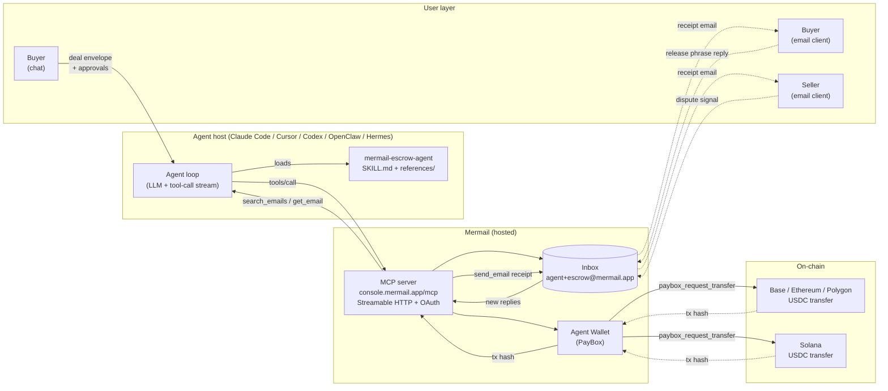
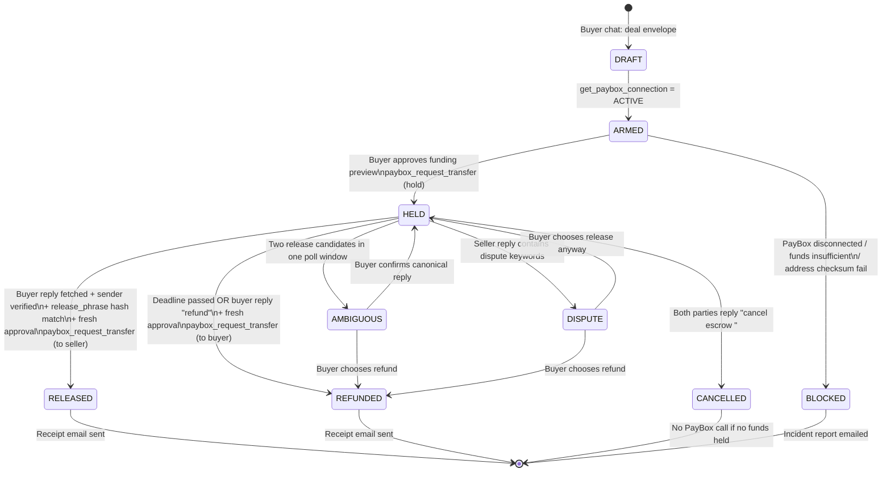
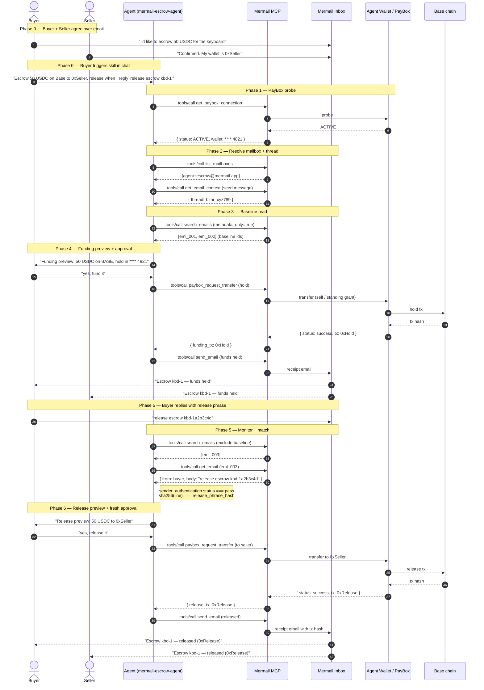
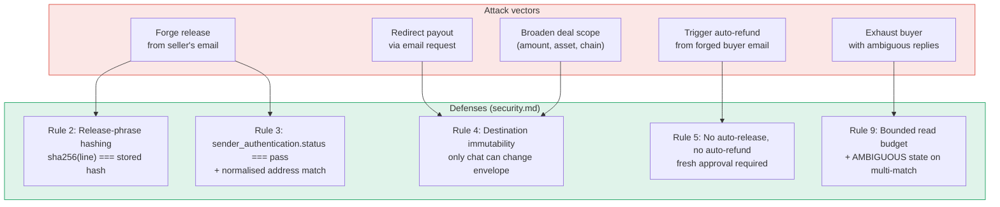
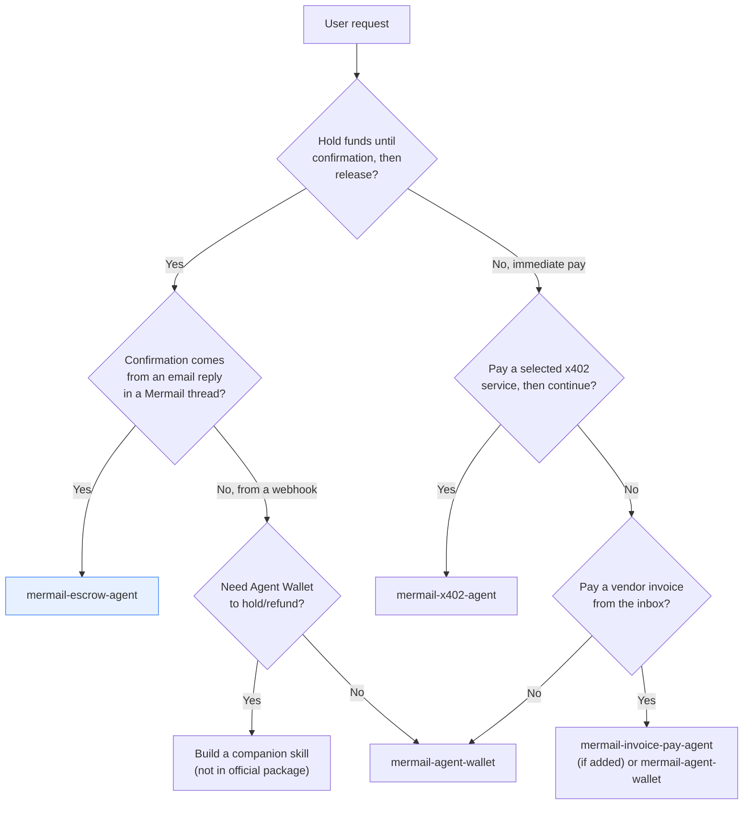
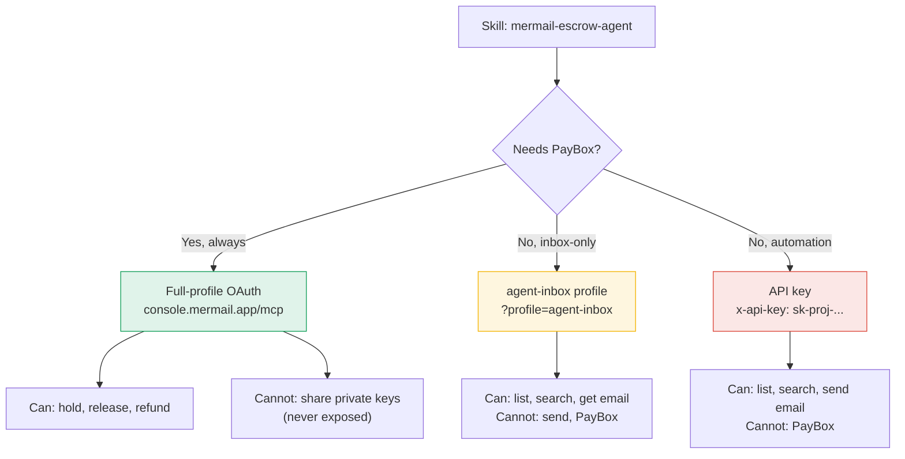

# Architecture

> Visual reference for `mermail-escrow-agent`. All diagrams are written in
> [Mermaid](https://mermaid.js.org/) and render natively on GitHub, in
> VS Code, and on the demo page.

## Component map

## State machine

## End-to-end sequence (happy path)

## Threat model + defenses

## Tool routing decision tree

## Data flow — deal record

```mermaid
flowchart LR
    subgraph Inputs["Inputs (chat only — never email)"]
        I1["amount_decimal"]
        I2["token, chain"]
        I3["seller_destination"]
        I4["deadline_iso"]
        I5["seller_email"]
    end

    subgraph Record["Deal record (JSON, stored as mailbox draft)"]
        R1["deal_id<br/>kbd-1a2b3c4d"]
        R2["state: DRAFT → ARMED → HELD → RELEASED"]
        R3["release_phrase_hash<br/>(sha256, not plaintext)"]
        R4["baseline_email_ids[]<br/>(excluded from polling)"]
        R5["funding_tx / release_tx / refund_tx"]
        R6["audit_log[]<br/>(ts + event + email_id)"]
    end

    subgraph Never["Never in record"]
        N1["private keys"]
        N2["signing URLs"]
        N3["raw signed payloads"]
        N4["release_phrase (plaintext)"]
        N5["MERMAIL_API_KEY"]
    end

    Inputs --> Record
    Record -.->|"never"| Never

    style Never fill:#db443720,stroke:#db4437
    style Record fill:#0f9d5820,stroke:#0f9d58
```

## MCP profile matrix

## Why this design (decisions log)

| Decision | Rationale |
| --- | --- |
| Email is the entire UI | No marketplace app, no smart contract deployment. Maximises "inbox + wallet both load-bearing" criterion. |
| Hold funds in buyer's own Agent Wallet (not a separate escrow contract) | Avoids deploying new smart contracts. Uses PayBox's existing delegation + standing grants as the policy boundary. |
| Release-phrase hashing (not plaintext storage) | Prevents the phrase from leaking via logs that quote email bodies. The hash is computed locally; only the hash is persisted. |
| Destination immutability from email | The #1 attack vector is a forged "please send to a different address" email. Hard rule: only chat can set/ change `seller_destination`. |
| Fresh approval for release (funding approval ≠ release approval) | Prevents a "approve once, drain wallet" attack if the buyer's chat session is hijacked mid-deal. |
| No auto-refund on deadline | Auto-refund on deadline would let an attacker who can delay the buyer's release phrase trigger a refund. The agent surfaces the deadline and asks the buyer to approve. |
| Composable, not duplicative (no new tool ownership) | Maximises chance of graduation into the official package. The `tool-coverage.json` patch only adds a `composes` entry. |
| 3 reference docs (tools, workflows, security) | Keeps `SKILL.md` under the 500-line AUTHORING.md limit while still being complete enough to re-implement from scratch. |
