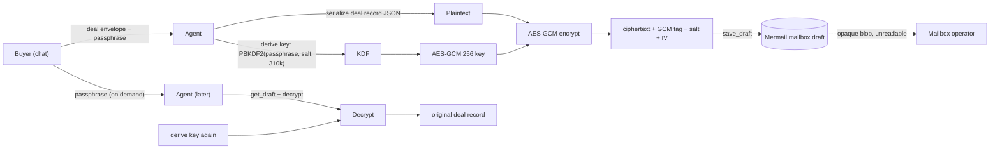

# BÓVEDA deal-vault integration

> **License: AL-1.0** — AliceLabs Source-Available License. See
> [`../../LICENSE-AL-1.0`](../../LICENSE-AL-1.0) and
> [`../../PROPRIETARY.md`](../../PROPRIETARY.md).

## What this adds

The MIT core stores the deal record as a JSON draft in the Mermail
mailbox. That draft is readable by anyone who can access the mailbox
(workspace members, Mermail operators, anyone with the API key).

This integration encrypts the deal record with **PBKDF2-SHA256 (310,000
iterations) → AES-GCM 256** before it is saved as a draft. The
encryption key is derived from a passphrase that only the buyer knows.
Mermail (and any other mailbox reader) sees only an opaque ciphertext
blob.

### Threat model delta

| Attack | MIT core defense | BÓVEDA integration adds |
| --- | --- | --- |
| Mailbox operator reads deal records (amounts, addresses, audit trail) | Trust in Mermail's hosted storage | + Ciphertext-only access — operator cannot read deal records without buyer's passphrase |
| Workspace member with read access snoops on deals | Workspace RBAC | + Encryption at rest with buyer-only key — even workspace admins cannot decrypt |
| Subpoena / legal request for deal records | Mermail's data policies | + AliceLabs cannot decrypt either (zero-knowledge) — only the buyer can |
| Deal record tampering in the mailbox | None (drafts are mutable) | + AES-GCM authenticated encryption — any tampering invalidates the GCM tag |

## How it works



## Components

### 1. `deal_vault.py` — encryption/decryption helper

A Python helper that:
- Derives an AES-GCM 256 key from a passphrase using PBKDF2-SHA256 with 310,000 iterations (OWASP 2023 recommendation for SHA-256)
- Generates a random 16-byte salt and 12-byte IV per encryption
- Encrypts the deal record JSON with AES-GCM (authenticated encryption)
- Returns a base64 payload: `salt(16) || iv(12) || ciphertext || tag(16)`
- Decrypts with the same passphrase

Uses only the Python standard library (`hashlib`, `os`, `base64`) plus
`cryptography` for AES-GCM. No external services.

### 2. SKILL extension — `SKILL.encrypted.md`

Modifies Phases 3, 4, 5, 6 of the workflow:
- Phase 3 (baseline read): also record `deal_vault_passphrase_hash` (a
  verifier, never the passphrase itself)
- Phase 4 (funding): encrypt the deal record before `save_draft`
- Phase 5 (monitor): decrypt the deal record on each poll to read state
- Phase 6 (release): re-encrypt the updated deal record after release

### 3. Receipt email format

The receipt email is **not** encrypted — it goes to the buyer and seller
over normal email. It contains only: deal_id, tx hash, amount, asset,
chain, timestamp, audit summary. The full deal record (with
release_phrase_hash, baseline_email_ids, etc.) stays encrypted in the
mailbox draft.

## Install

```bash
# The cryptography package is required
pip install cryptography

# Add the integration to your skills directory
cp -R integrations/boveda-deal-vault ~/.claude/skills/mermail-escrow-agent-integrations/
```

## Configuration

Add to the deal envelope (in chat):

```yaml
integrations:
  boveda_deal_vault:
    enabled: true
    passphrase: "buyer-supplied secret phrase"  # never logged, never emailed
    kdf_iterations: 310000                       # OWASP 2023 for SHA-256
    verifier_hash: "sha256(passphrase)"          # stored in deal record for UX check
```

The passphrase:
- Is supplied by the buyer in chat at deal creation
- Never leaves the agent's process (not logged, not emailed, not persisted in the deal record)
- Only a `verifier_hash` (sha256 of the passphrase) is stored, so the
  agent can sanity-check the passphrase on later decryptions without
  storing the passphrase itself
- If the buyer forgets the passphrase, the deal record is unrecoverable
  (this is the price of zero-knowledge)

## Composability with the MIT core

The MIT core's deal record schema is unchanged. The integration:

1. **Wraps** the JSON deal record in an encrypted envelope before `save_draft`
2. **Unwraps** it after `get_draft`
3. The MIT core's logic operates on the plaintext deal record in memory

This means a builder can:
- Use only the MIT core → plaintext deal records in mailbox drafts (works everywhere)
- Add BÓVEDA → encrypted deal records, zero-knowledge to Mermail

## Why PBKDF2 + AES-GCM and not age / GPG?

- **WebCrypto parity.** BÓVEDA (the sister project) uses the same
  PBKDF2-SHA256 + AES-GCM combination in the browser. Using the same
  algorithm means the deal record could be decrypted in the browser by
  the buyer, without needing Python.
- **Standard library.** `hashlib.pbkdf2_hmac` is in the Python stdlib.
  AES-GCM needs `cryptography` (or `pycryptodome`), which is ubiquitous.
- **No key management.** age and GPG require key files. PBKDF2 from a
  passphrase requires only the passphrase — easier for a chat-based
  agent workflow.

## References

- BÓVEDA repo: <https://github.com/eddyflores100-lang/boveda>
- OWASP password storage cheat sheet (PBKDF2 iterations):
  <https://cheatsheetseries.owasp.org/cheatsheets/Password_Storage_Cheat_Sheet.html>
- NIST SP 800-38D (GCM): <https://nvlpubs.nist.gov/nistpubs/Legacy/SP/nistspecialpublication800-38d.pdf>

## Trademark notice

"BÓVEDA" is a trademark of AliceLabs LLC. Use of this mark in connection
with this integration requires written authorization from AliceLabs.
The MIT core of `mermail-escrow-agent` does not use any AliceLabs
trademark.
