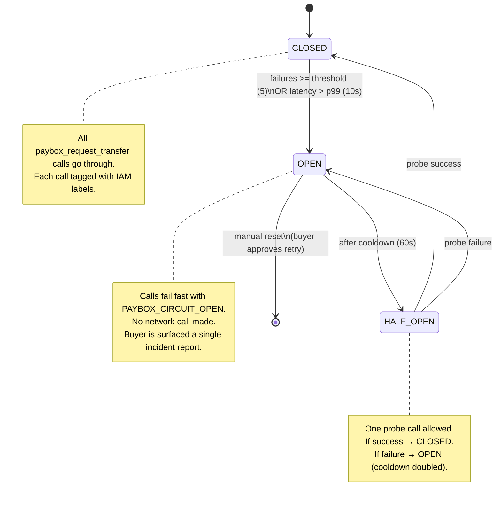

# mcp-vault Circuit Breaker integration

> **License: AL-1.0** — AliceLabs Source-Available License. See
> [`../../LICENSE-AL-1.0`](../../LICENSE-AL-1.0) and
> [`../../PROPRIETARY.md`](../../PROPRIETARY.md).

## What this adds

The MIT core treats PayBox failures conservatively: `pending` and
`SUBMISSION_UNKNOWN` are unresolved, no automatic retry, surface to the
buyer. That is correct but blunt — if PayBox has a transient outage
(e.g. 5xx storm for 30 seconds), the buyer sees a confusing "blocked"
state and the deal stalls.

This integration adds a **Circuit Breaker** around every
`paybox_request_transfer` call, inspired by the
[`mcp-vault-server`](https://github.com/alicelabs-llc/mcp-vault-server)
circuit breaker pattern. The breaker has three states:

- **CLOSED** — normal operation, all calls go through
- **OPEN** — PayBox is failing; calls fail fast without hitting the network
- **HALF_OPEN** — limited probe traffic to test if PayBox has recovered

It also adds **IAM labels** on every call (deal_id, buyer_id, seller_id,
phase) for granular auditability — the same pattern `mcp-vault-server`
uses for zero-trust key management.

### Threat model delta

| Attack / failure mode | MIT core defense | Circuit breaker adds |
| --- | --- | --- |
| PayBox transient outage (5xx storm) | Surface to buyer, deal stalls | + Fail fast after N failures, resume automatically when PayBox recovers |
| Retry storm (agent retries on every poll) | "No automatic retry" rule | + Breaker OPEN state prevents any call until cooldown, so even a misbehaving agent cannot hammer PayBox |
| PayBox slow-degrading (increasing latency) | Not detected | + Latency threshold trips the breaker before total failure |
| Audit gap (which call failed when?) | audit_log in deal record | + IAM-labeled events: `(deal_id, buyer_id, seller_id, phase, call_id, latency, outcome)` |
| Credential leak via logs | "No secret leakage" rule | + IAM labels never include secrets — only opaque IDs already in the deal record |

## How it works



## Components

### 1. `circuit_breaker.py` — the breaker itself

A Python class that wraps every `paybox_request_transfer` call. Tracks:
- `failures` — consecutive failures in CLOSED state
- `opened_at` — timestamp when OPEN was entered
- `cooldown_seconds` — doubles on each HALF_OPEN failure (60, 120, 240, max 600)
- `iam_labels` — attached to every call for audit

Configuration:
```python
CircuitBreaker(
    failure_threshold=5,        # trip after 5 consecutive failures
    latency_threshold_ms=10000, # trip if any call exceeds 10s
    cooldown_seconds=60,        # initial OPEN→HALF_OPEN cooldown
    max_cooldown_seconds=600,   # cap at 10 minutes
    half_open_max_calls=1,      # only 1 probe in HALF_OPEN
)
```

### 2. `iam_labels.py` — label generator

Generates IAM-style labels for each call:
```json
{
  "deal_id": "kbd-1a2b3c4d",
  "buyer_id": "sha256(buyer_email)[:12]",
  "seller_id": "sha256(seller_email)[:12]",
  "phase": "funding|release|refund",
  "call_id": "uuid4",
  "attempt": 1,
  "timestamp": "2026-09-10T14:22Z"
}
```

These labels are attached to the call's audit log entry. They never
include secrets, private keys, or raw email addresses — only hashes and
opaque IDs already present in the deal record.

### 3. SKILL extension — `SKILL.breaker.md`

Modifies Phases 4, 6, 7 of the workflow:
- Every `paybox_request_transfer` call goes through the breaker
- If the breaker is OPEN, the agent surfaces a single incident report
  (not one per failed call) and pauses
- The breaker's state is recorded in the deal record's `audit_log`

## Install

```bash
# No external dependencies — pure Python stdlib
cp -R integrations/mcp-vault-circuit-breaker ~/.claude/skills/mermail-escrow-agent-integrations/
```

## Configuration

Add to the deal envelope:

```yaml
integrations:
  mcp_vault_circuit_breaker:
    enabled: true
    failure_threshold: 5
    latency_threshold_ms: 10000
    cooldown_seconds: 60
    max_cooldown_seconds: 600
    iam_labels: true   # attach IAM labels to every call
```

## Composability with the MIT core

The MIT core's "no automatic retry" rule is **not violated** by the
circuit breaker. The breaker:

- Does **not** retry failed calls automatically
- Does **not** resume a stalled deal without buyer approval
- Only **prevents** new calls while PayBox is in a known-bad state
- Surfaces a single, clear incident report instead of N confusing ones

The MIT core's `pending` / `SUBMISSION_UNKNOWN` handling is unchanged
— those are still treated as unresolved, and the buyer is still asked
for one explicit choice.

## Why not just use the MIT core's "no automatic retry" rule?

The MIT core rule is correct but does not distinguish between:
- A single transient failure (network blip) → buyer sees "blocked",
  deal stalls, manual intervention needed
- A sustained PayBox outage (5 minutes of 5xx) → buyer sees "blocked"
  N times, each with a confusing error

The circuit breaker:
- Absorbs transient failures (1-2 failures don't trip it)
- Detects sustained outages (5 failures trip it)
- Resumes automatically when PayBox recovers (HALF_OPEN probe)
- Reduces buyer fatigue (one incident report, not N)

## References

- mcp-vault-server: <https://github.com/alicelabs-llc/mcp-vault-server>
- Martin Fowler on Circuit Breakers:
  <https://martinfowler.com/bliki/CircuitBreaker.html>
- Google SRE book, Chapter 22 (Addressing Cascading Failures):
  <https://sre.google/sre-book/addressing-cascading-failures/>

## Trademark notice

"mcp-vault" is a trademark of AliceLabs LLC. Use of this mark in
connection with this integration requires written authorization from
AliceLabs. The MIT core of `mermail-escrow-agent` does not use any
AliceLabs trademark.
