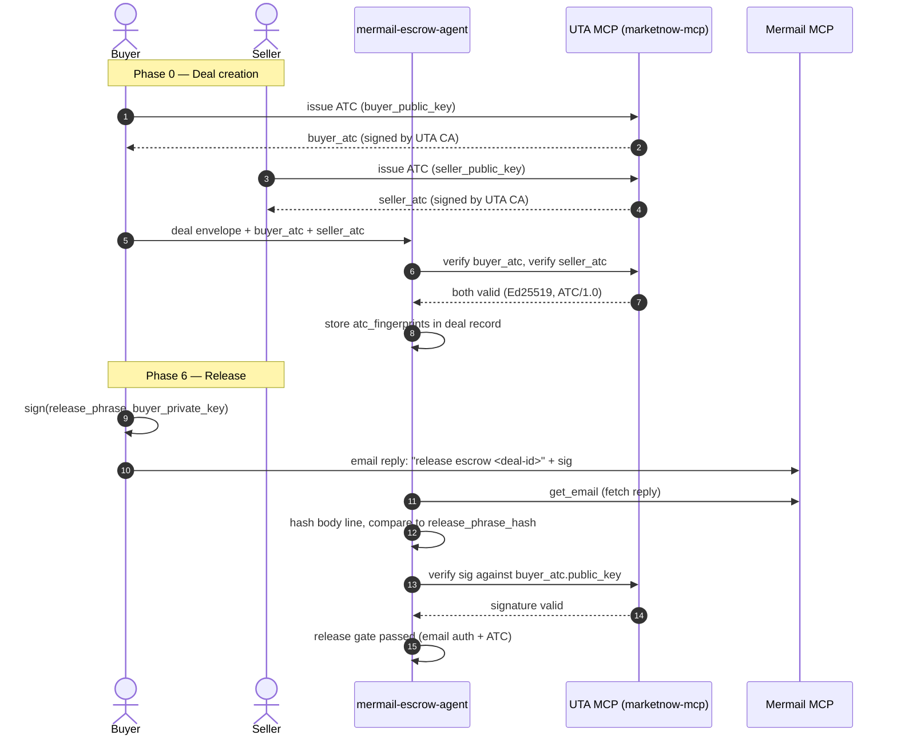

# UTA Trust Cards integration

> **License: AL-1.0** — AliceLabs Source-Available License. See
> [`../../LICENSE-AL-1.0`](../../LICENSE-AL-1.0) and
> [`../../PROPRIETARY.md`](../../PROPRIETARY.md). Commercial use requires
> a license from AliceLabs LLC (`legal@alicelabs.site`).

## What this adds

The MIT-licensed core of `mermail-escrow-agent` authenticates the buyer's
release phrase by checking `sender_authentication.status === pass` on the
inbound email. That is the strongest signal Mermail's MCP exposes, but it
only proves the email came through a sender-authenticated path (SPF / DKIM /
DMARC). It does **not** prove the human (or agent) who typed the release
phrase is the same one who signed the original deal envelope.

This integration adds a **second cryptographic layer** on top of email
authentication: every deal envelope is co-signed by the buyer and the
seller using **Agent Trust Cards (ATC/1.0)** from the
[Universal Trust Adapter](https://github.com/alicelabs-llc/universal-trust-adapter).
The release phrase is then matched not only against the email's
`sender_authentication.status`, but also against an ATC signature that
only the buyer's private key can produce.

### Threat model delta

| Attack | MIT core defense | UTA integration adds |
| --- | --- | --- |
| Forged release email from buyer's address | `sender_authentication.status === pass` + release-phrase hash | + ATC signature on the release phrase, verifiable without trusting the email path |
| Compromised buyer mailbox (attacker can send from buyer's address) | Detectable only if Mermail flags auth failure | + Attacker cannot produce a valid ATC signature without the buyer's private key |
| Seller impersonation (forged seller email asking to change destination) | Destination immutability (refused from email) | + Seller's ATC is presented at deal creation; any later seller email without a matching ATC signature is flagged |
| Deal envelope tampering (attacker modifies amount/destination in transit) | Deal record stored as mailbox draft | + Deal envelope is ATC-signed by both parties at creation; any tampering invalidates the signature |

## How it works



## Components

### 1. `trust_card_gate.py` — ATC verification helper

A Python helper that wraps the `agent-trust-card` NPM package (via a
small subprocess call) or the `marketnow-mcp` MCP server. It exposes
three functions:

- `issue_trust_card(agent_id, public_key_pem)` → returns an ATC/1.0 card
- `verify_trust_card(atc_json)` → returns `{valid: bool, controls_passed: [...]}`
- `verify_signature(message, signature_b64, public_key_pem)` → returns bool

### 2. SKILL extension — `SKILL.utrusted.md`

A drop-in replacement for `SKILL.md` that adds the ATC verification
steps. The MIT core's `SKILL.md` is unchanged; this extension is
optional and only loaded when the builder has the UTA integration
installed.

### 3. Test scenarios — `scenarios.utrusted.json`

Additional scenarios that exercise the ATC layer:

- Release with valid ATC signature → success
- Release with forged ATC signature → blocked
- Release with no ATC signature (only email auth) → fallback to MIT core behavior
- Deal creation with seller ATC that fails verification → blocked at Phase 0

## Install

```bash
# Install the UTA SDK (NPM)
npm install agent-trust-card

# Or run the UTA MCP server alongside Mermail MCP
npm install -g marketnow-mcp
marketnow-mcp  # exposes 13 trust tools over MCP

# Add the integration to your skills directory
cp -R integrations/uta-trust-cards ~/.claude/skills/mermail-escrow-agent-integrations/
```

## Configuration

Add to the deal envelope (in chat, alongside the MIT core fields):

```yaml
integrations:
  uta_trust_cards:
    enabled: true
    buyer_atc: "atc_1.0_buyer_..."   # ATC/1.0 card JSON
    seller_atc: "atc_1.0_seller_..." # ATC/1.0 card JSON
    require_atc_for_release: true    # default true
    require_atc_for_refund: true     # default true
```

If `require_atc_for_release` is true, the release gate in Phase 6 of the
workflow requires **both**:

1. `sender_authentication.status === pass` on the fetched email (MIT core rule)
2. A valid ATC signature on the release phrase, verifiable with the
   buyer's ATC public key

If the ATC signature is missing or invalid, the agent stops in
`BLOCKED` state and surfaces the failure to the buyer. It does **not**
fall back to email-only auth — that would defeat the purpose.

## Composability with the MIT core

The MIT core skill is unaware of ATC. The integration works by:

1. **Deal record extension.** The deal record gains an `integrations.uta_trust_cards` field. The MIT core ignores unknown fields.
2. **Phase 6 augmentation.** The integration's `trust_card_gate.py` is called by the agent after the MIT core's sender-auth check, but before the release preview. The agent's prompt instructs it to call the gate if the integration is configured.
3. **Receipt email augmentation.** The receipt email gains an
   `ATC-verified: yes` header line. The MIT core's receipt format is
   unchanged.

This means a builder can:

- Use only the MIT core → no ATC, works everywhere
- Add the UTA integration → ATC verification on top, no breaking changes

## Why ATC/1.0 and not ATC v3.0?

ATC/1.0 is single-sig (Ed25519) and stable. ATC v3.0 is multi-sig
(N-of-M) and still in draft. For escrow, single-sig is sufficient:
each party has one identity, one signature. Multi-sig would be useful
for "2-of-3 escrow arbitration" (buyer + seller + arbitrator), which is
a future extension.

## References

- UTA repo: <https://github.com/alicelabs-llc/universal-trust-adapter>
- ATC/1.0 spec: [`marketnow/docs/atc-spec/SPEC.md`](https://github.com/alicelabs-llc/universal-trust-adapter/blob/main/marketnow/docs/atc-spec/SPEC.md)
- `agent-trust-card` SDK: <https://www.npmjs.com/package/agent-trust-card>
- `marketnow-mcp` MCP server: <https://www.npmjs.com/package/marketnow-mcp>
- MarketNow site: <https://marketnow.site>

## Trademark notice

"Universal Trust Adapter", "UTA", "ATC", "Agent Trust Credential" are
trademarks of AliceLabs LLC. Use of these marks in connection with this
integration requires written authorization from AliceLabs. The MIT core
of `mermail-escrow-agent` does not use any AliceLabs trademark.
